# Build the machine learning model that powers ContosoBNB #

<a name="Overview"></a>

## Overview ##

In this hands-on lab (HOL), you are a newly hired data scientist for a company building an application named ContosoBNB, which is modeled after a short-term vacation rental platform like [Airbnb](https://www.airbnb.com/). Your goal is to begin building, training, and tuning a machine learning model to suggest a rental rate that maximizes revenue for rental property owners.

First, you will reduce the complexity of building your development environment by creating an instance of the Data Science Virtual Machine (DSVM): a virtual-machine (VM) image built specifically for data-science workloads. The DSVM is hosted in Microsoft Azure, and it has editions built for Windows Server, Ubuntu Linux, and CentOS Linux. The DSVM comes preconfigured with many popular open-source tools, including Jupyter and RStudio. This VM also contains scikit-learn, which is a free, open-source machine learning toolkit for Python programmers.

After you create a Linux operating system (OS)-based DSVM and connect to it, you will import a dataset and then use the scikit-learn API to create and refine an ML model to use with your dataset.

<a name="Objectives"></a>

### Objectives ###

In this HOL, you will learn how to:

- Create a Linux OS-based DSVM
- Connect to the DSVM using a remote desktop client
- Save a data file from GitHub to the DSVM
- Save a Jupyter Notebook file from GitHub to the DSVM
- Use [pandas](http://pandas.pydata.org/) to filter columns in a dataset
- Use pandas to calculate values in a column
- Use scikit-learn to split the data into separate datasets for training and testing
- Use scikit-learn to create an ML model
- Use scikit-learn to analyze the model's accuracy

<a name="Prerequisites"></a>

### Prerequisites ###

The following are required to complete this HOL:

- An Azure subscription, which will be used to create the VM and query Data Lake. Students can get access through [Azure for Students](http://aka.ms/azure4students).
- [X2Go](https://wiki.x2go.org/doku.php/download:start), an [Xfce](https://xfce.org/) remote-desktop client. [Installation instructions](https://wiki.x2go.org/doku.php/doc:installation:x2goclient).

**Note:** To quickly verify your student status, use your school-issued email address like "your_name@your_school.edu" or equivalent. This will become your Microsoft Account that you can use to login to the [Azure Portal](http://portal.azure.com).

<a name="Resources"></a>

### Resources ###

This lab uses an existing dataset (released under public domain) to model real-world property listings with their associated details. The complete dataset can be found [here](http://insideairbnb.com/get-the-data.html).

<a name="Exercises"></a>

## Exercises ##

This HOL includes the following exercises:

- [Exercise 1: Create a DSVM](#Exercise1)
- [Exercise 2: Connect to the DSVM](#Exercise2)
- [Exercise 3: Download a dataset and prepare a Jupyter notebook](#Exercise3)
- [Exercise 4: Import data, clean data, and make predictions using Python/scikit-learn in a Jupyter notebook](#Exercise4)

<a name="Exercise1"></a>

## Exercise 1: Create a DSVM ##

In this exercise, you will create an instance of the DSVM for Linux in Azure. The DSVM for Linux is a VM image in Azure that includes many preinstalled and configured data-science and development tools. You can read a longer description about the many tools and features available in the DSVM [here](https://azuremarketplace.microsoft.com/en-us/marketplace/apps/microsoft-ads.linux-data-science-vm-ubuntu).

### Step 1: Creating the DSVM in Azure ###

1. In a web browser, open the [Azure portal](https://portal.azure.com/) at https://portal.azure.com, and then sign in with your Microsoft account (use the account your Azure subscription is associated with).
1. From the left-side menu, click the **+** sign to add a new resource.

    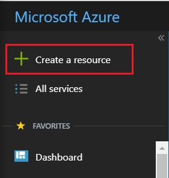

1. In the **Search** field, type **data science**. From the list of matching results, click **Data Science Virtual Machine for Linux (Ubuntu)**.

    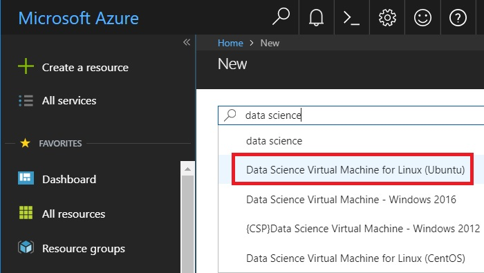

1. Take a few moments to read the description of the DSVM for Linux (Ubuntu), and then click **Create**.

    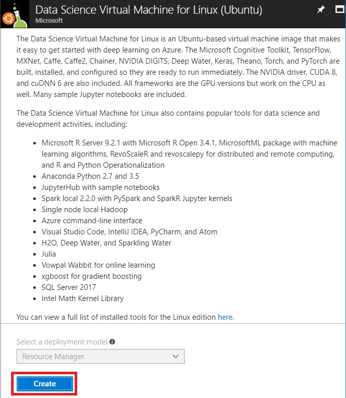

1. In the **Name** field, enter a name for your VM; for example, **MyDSVM**.

    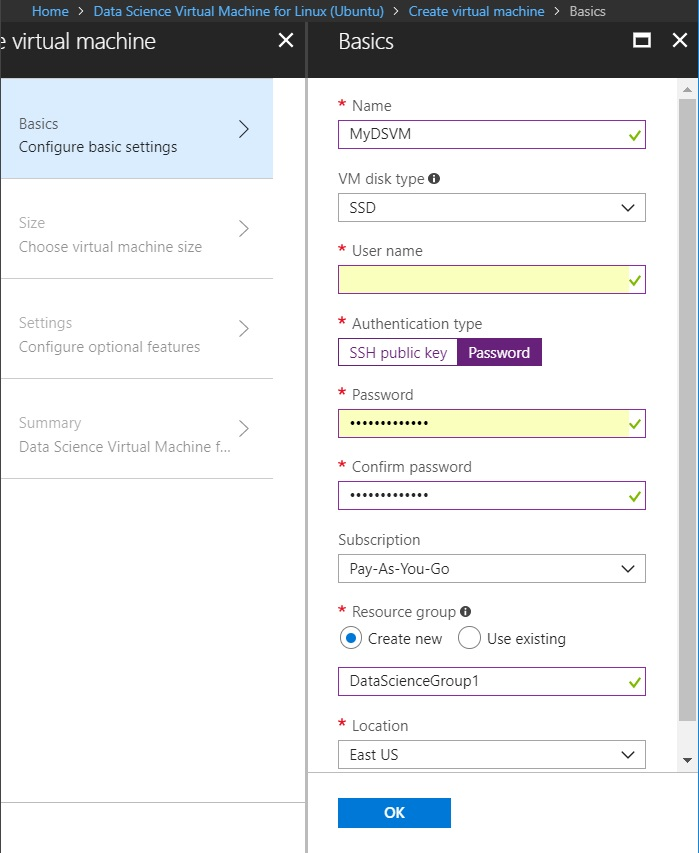

1. In the **VM disk type** field, select **SSD**.

1. In the **User Name** field, type a user name of your choice.

1. For **Authentication Type**, select **Password**.

1. In the **Password** field, enter a password of your choice that meets the following requirements:
    - Must be between 12 and 72 characters long
    - Must contain three of the following:
        - One lowercase letter
        - One uppercase letter
        - One number
        - One special character that is not "\" or "-"

    Save your username and password, because you will use it to sign in to the VM later.

1. IIn the **Subscription** drop-down menu, select your current Azure Subscription. Most users will only have one but it's possible to have many.

1. In the **Resource Group** section, leave **Create New** selected, and then enter a name of your choice for the resource group in the field below; for example, **DataScienceGroup1**.

    A [resource group](https://docs.microsoft.com/azure/azure-resource-manager/resource-group-overview) in Azure is a container for the resources used to run an application. Resource groups help administrators organize monitoring, access control, provisioning, and billing. Generally, items in one resource group are intended to have the same lifecycle, so you can easily deploy, update, and delete them as a group.

1. In the **Location** drop-down menu, ensure that a geographically close location is chosen.

1. Click **OK**.

At this stage, the Choose a Size page appears. Proceed to the next step.

### Step 2: Sizing the new VM and reviewing settings ###

1. On the **Choose A Size** page, click **View All**.

    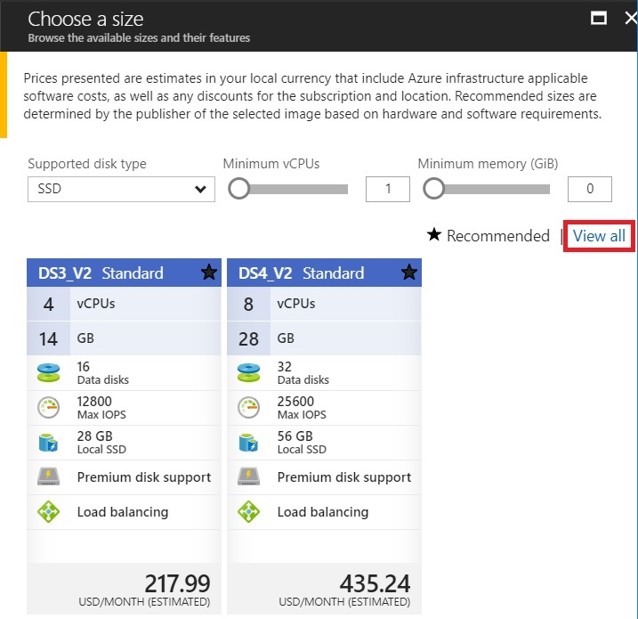

1. In the list of available VM types, select **DS1_V2 Standard**. Notice the wide range of VM choices available. Azure provides these according to the growing needs of your workload or application - for example, you might need the high memory allocation (G-series) or additional GPUs (N-series) that maximize the performance of deep-learning experiments (like image classification). Some VMs are most cost-effective for early experiementation (A-series, Dv2 series. A D-series is a good starting point for this lab. You can learn more [here](https://docs.microsoft.com/en-us/azure/cloud-services/cloud-services-sizes-specs) or [here](https://blogs.msdn.microsoft.com/uk_faculty_connection/2016/09/12/choosing-the-most-appropiate-azure-virtual-machine-specification/).

    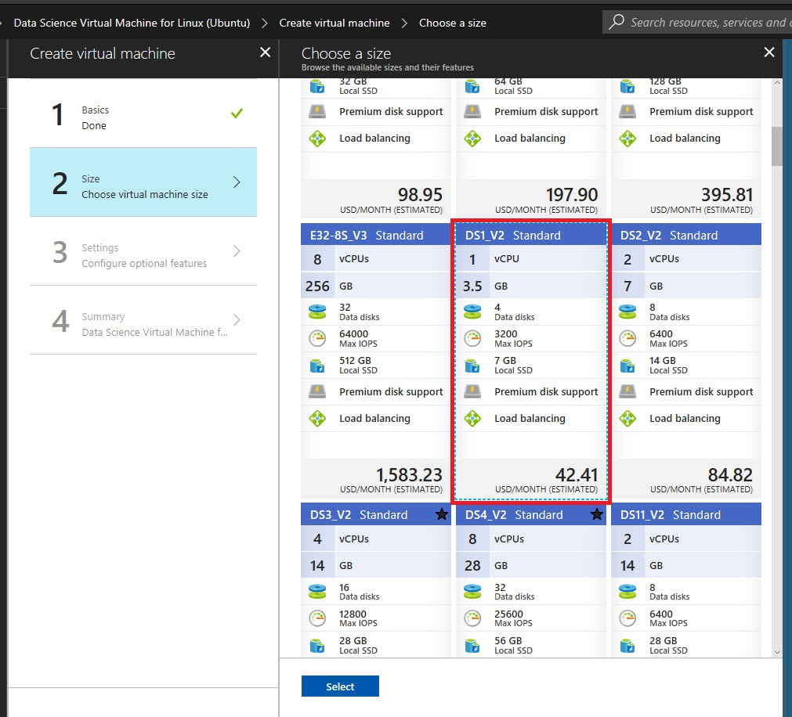

1. Click **Select**.

1. On the **Settings** page that appears, review the default settings, and then click **OK**. The **Create** page appears, displaying offer details and summary information.

1. Click **Create**.
1. Wait a few minutes while the DSVM is deployed. After it is deployed, you will see a dashboard for your new VM. At the top of the dashboard, you will see controls.

    

1. The **Start** button is not available, indicating that the new VM has already started.

<a name="Exercise2"></a>

## Exercise 2: Connect to the DSVM ##

In this exercise, you will use a local X2Go client to connect to your new VM in Azure.

1. If you have not already done so, download and install X2Go on your local device. You can download it [here](https://wiki.x2go.org/doku.php/download:start). Instructions [here](https://wiki.x2go.org/doku.php/doc:installation:x2goclient).

    *Check [these docs](https://docs.microsoft.com/en-us/azure/machine-learning/data-science-virtual-machine/linux-dsvm-intro#installing-and-configuring-x2go-client) for more information on using X2Go on the Linux Data Science Virtual Machine.*

1. Open X2Go. If you see any security alerts related to firewalls, now or later during these exercises, click **Allow Access**.

1. If the Session Preferences dialog box does not open automatically, from the **Session** menu, click **New Session**.

    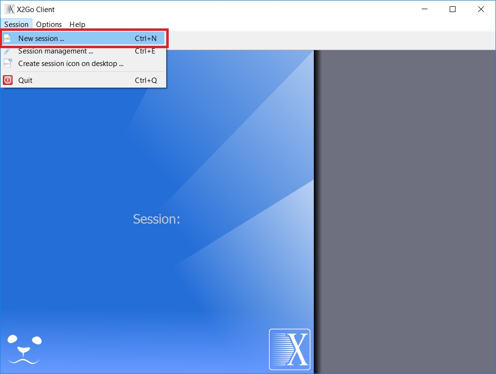

1. Return to your web browser and to the Azure portal at <https://portal.azure.com,> which you opened in Exercise 1.

1. In the **Overview** section, which displays information about the new VM you have created, locate and copy the VM’s public IP address.

    

1. Return to the **Session Preferences** dialog box in X2Go. Paste the IP address of the Azure VM, which you just copied, into the **Host** field.

    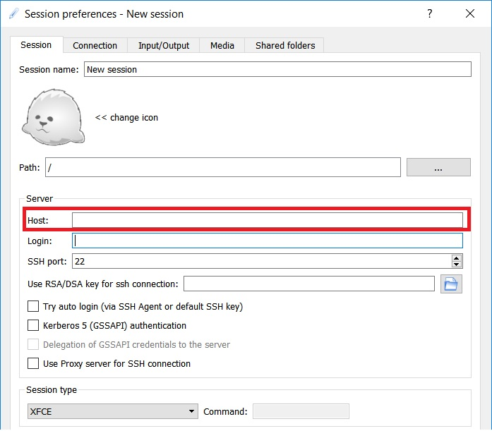

1. In the **Login** field, type the user name you chose for your new VM in Exercise 1.

1. Change the **Session Type** setting to **XFCE**.

    

1. Click **OK**.

1. In the X2Go client window, begin a new session by clicking the **New Session** window on the right that displays the IP address you just pasted.

    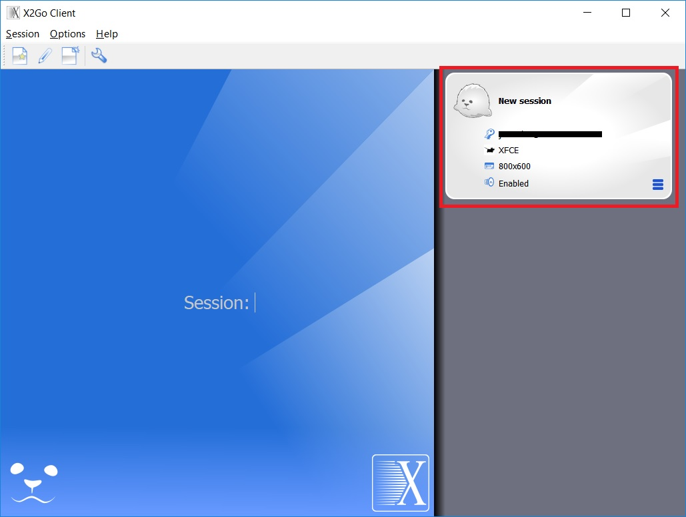

1. In the **New Session** window, supply the password you specified when you created the VM in Exercise 1, and then click **OK**.

    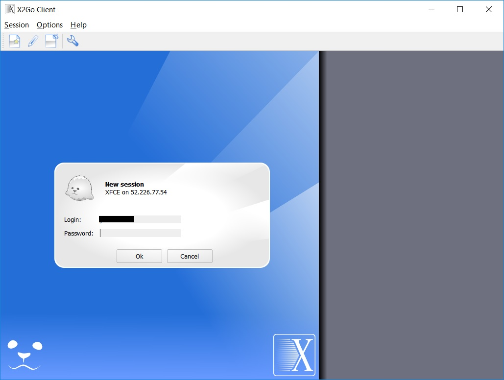

1. If you see a message that the host key verification failed, click **Yes** to trust the host key.

    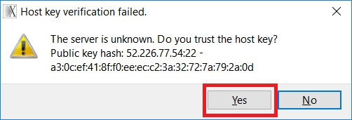

1. Wait a couple of minutes for a connection to the VM to establish.

    After the connection to the VM completes, a new window opens displaying the VM desktop and then a web page.

    

1. As needed, resize the window displaying the desktop of the DSVM. By default, a webpage is displayed that provides information about the DSVM.

1. Minimize the web browser, take a moment to review the icons on the desktop, and then proceed to Exercise 3.

    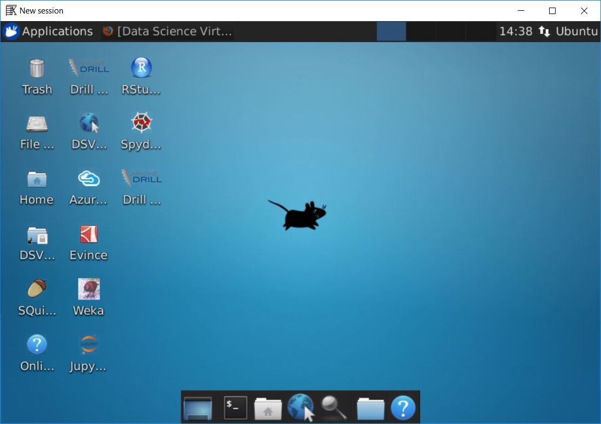

<a name="Exercise3"></a>

## Exercise 3: Download a dataset and prepare a Jupyter notebook ##

In this exercise, you will copy a dataset and a Jupyter file from GitHub to a new /notebooks/BnB directory on your DSVM. These files will be used to run machine learning algorithms in a Jupyter notebook in Exercise 4.

Perform the following procedures in the X2Go session window that is connected to the DSVM hosted on Azure.

### Step 1: Copying and decompressing the dataset ###

1. In the DSVM, open a terminal emulator (or shell) by clicking on the appropriate icon at the bottom of the screen.

    

1. Within the shell you just opened, create and switch to a new directory named **BnB** within the **~/notebooks** directory by entering the following three commands, one at a time:

    ```shell
    cd notebooks
    mkdir BnB
    cd BnB
    ```

    **Note:** On Linux all commands and directory names are case-sensitive.

1. In the DSVM, open a web browser by clicking on the appropriate icon at the bottom of the screen.

    

1. Browse to the following address: <https://github.com/Microsoft/computerscience/tree/master/Azure%20University%20Tour/MachineLearningHOL/content>

1. From the list of files in this directory, locate and click **listings.csv.gz**, and then click **Download** to save the file. The file will automatically save to the Downloads directory.

1. From the list of files in this same /content directory, locate and click **iPY_run_annotated.png**, and then click **Download**. Right-click the image in the browser and select **Save Image As**. Choose to save the file in the /notebooks/BnB/ directory.

1. In the DSVM, use **File Manager** (available at the bottom of the screen) to move **listings.csv.gz** from the **Downloads** directory to the **/notebooks/BnB/** directory.

    

1. The file now needs to be decompressed. Return to the terminal emulator, and type the following in the shell:

    ```shell
    gunzip listings.csv.gz
    ```
    The file listings.csv has now replaced listings.csv.gz in the /notebooks/BnB directory.

### Step 2: Saving the Jupyter Notebook file and opening the notebook ###

In this step, you will save a Jupyter Notebook document from GitHub to the /notebooks/BnB directory in your DSVM.

1. In the DSVM, return to the web browser, and then navigate to <https://github.com/Microsoft/computerscience/tree/master/Azure%20University%20Tour/MachineLearningHOL/content>

1. Click **Machine_Learning_HOL_Ex4.ipynb**, click **Raw** in the top-right portion of the screen, and then press Ctrl+S to save the file to the /notebooks/BnB/ directory.

    

    You will now open the Jupyter Notebook web application and then the notebook you just saved.

1. Select **Jupyter.Desktop** and click **Raw**.

1. Copy the content of the file.

1. On the desktop of the DSVM, Right-click the Jupyter.desktop file and select **Open With > Open With“Visual Studio Code”**

    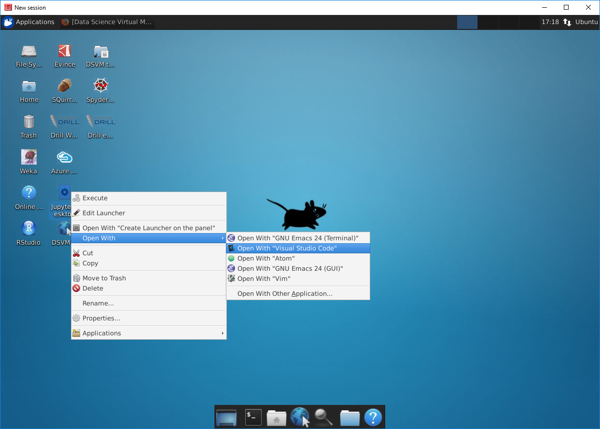

1. Paste the update configuration.

1. Save the file.

1. Close the file.

1. The Jupyter shortcut will update on the desktop.

    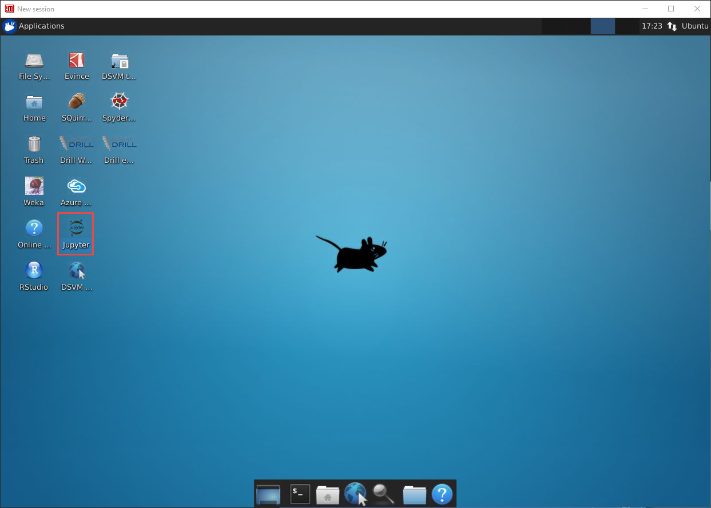

1. Open a terminal and run the following command: `jupyter notebook --generate-config`

    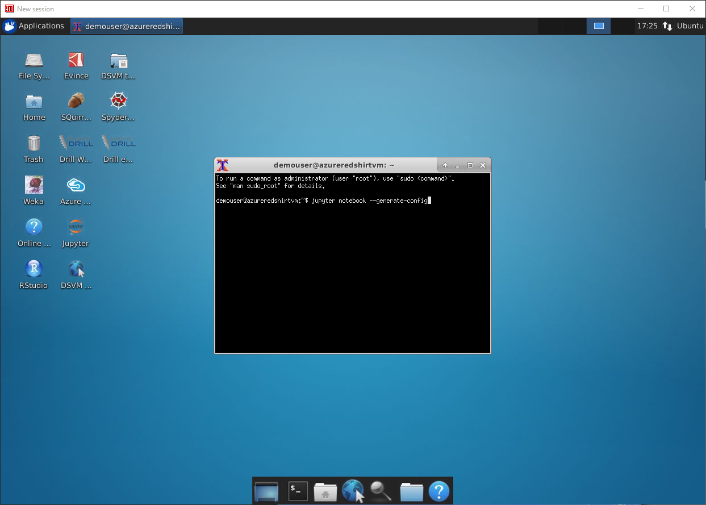

1. Next, run the following command: `jupyter notebook password`

    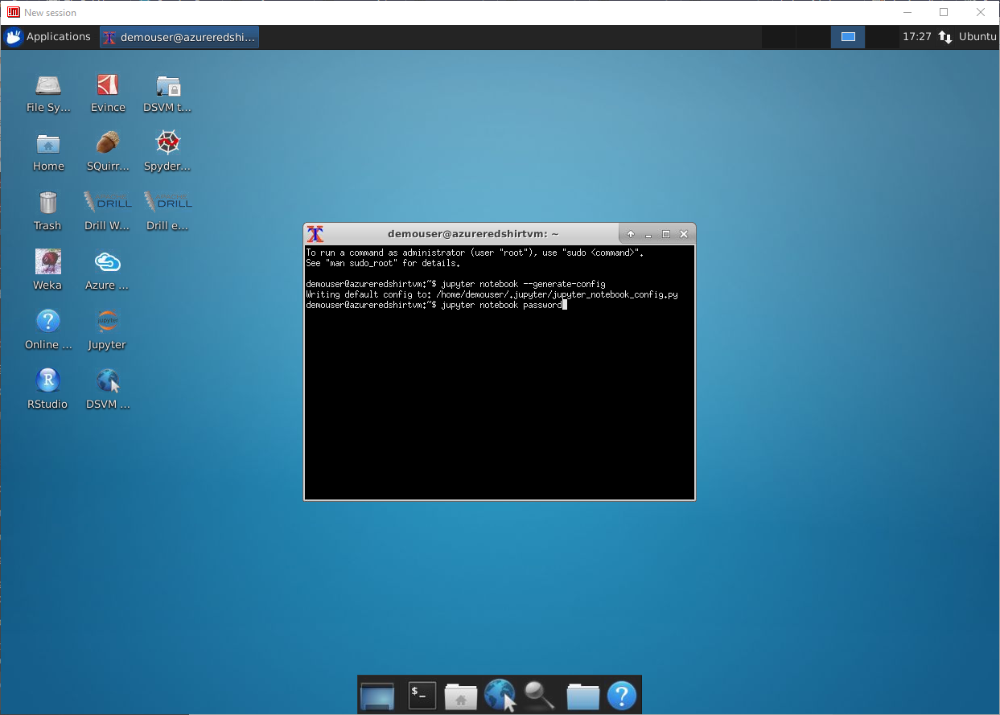

1. When requested, create a good password.

1. From the desktop, run the Jupyter server. Take note of the new URL.

    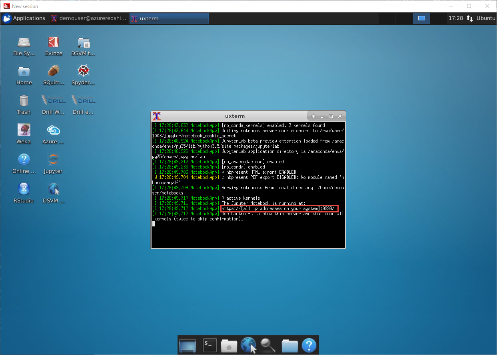

1. Browse to <https://localhost:9999> and confirm the exception.

    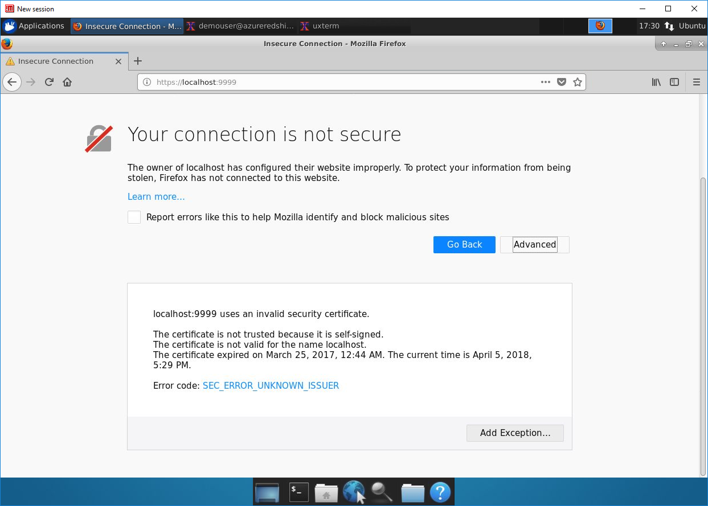

1. Log in using the password you created earlier. A UXTerm terminal opens, and then a webpage opens to http://localhost:8888/tree. Inside this webpage, the Jupyter Notebook web application displays the dashboard, which contains a number of directories and Jupyter notebooks.  The Jupyter Notebook dashboard maps to the /notebooks directory within the file structure of the DSVM.

    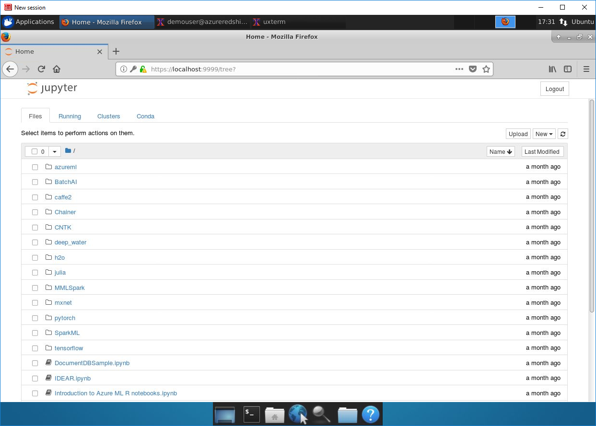

1. In the Jupyter Notebook dashboard displayed at <http://localhost:8888,> double-click to open the **/BnB** directory, and then double-click **Machine_Learning_HOL_Ex4.ipynb**.

    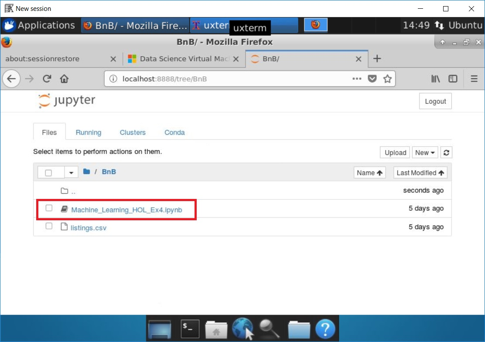

    The Machine_Learning_HOL_Ex4.ipynb notebook will require a few moments to complete loading in the browser.

1. If you receive a Kernel Not Found message, select **Python 3.5** from the drop-down menu, and then click **Set Kernel**.

Once the notebook is fully displayed, continue to Exercise 4.

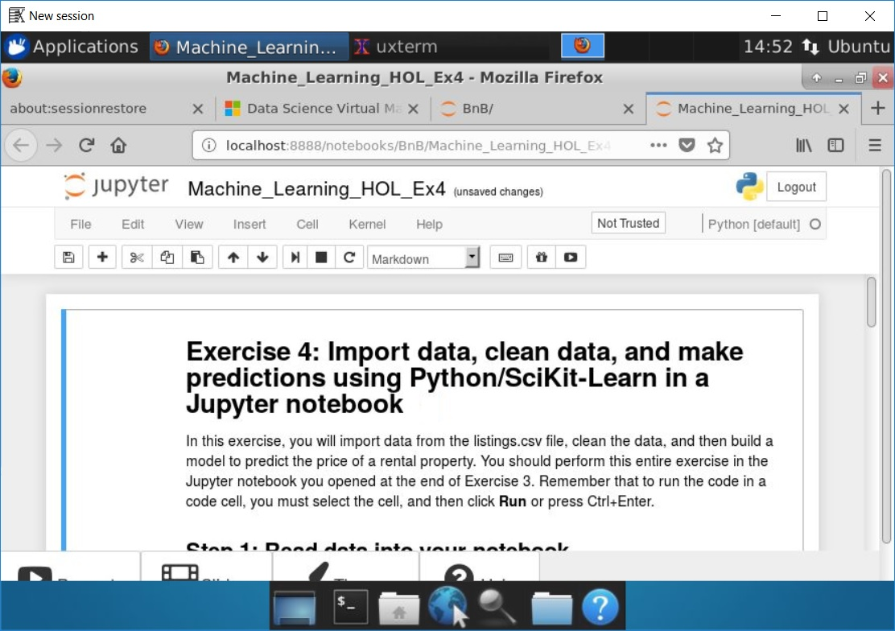

<a name="Exercise4"></a>

## Exercise 4: Import data, clean data, and make predictions using Python/SciKit-Learn in a Jupyter notebook ##

*This exercise is performed in the Jupyter notebook you opened at the end of Exercise 3. The Jupyter notebook includes all of the instructions for the exercise, which includes a series of code samples to run.*

**Important: After you done with Exercise 4, be sure to shut down the DSVM in Azure.**

In this exercise, you will import data from the listings.csv file, clean the data, and then build a model to predict the price of a rental property. You should perform this entire exercise in the Jupyter notebook you opened at the end of Exercise 3.

### Stopping the DSVM ###
Before completing the lab, make sure you shut down the virtual machine you created in Microsoft Azure.

1. In a web browser, open the Azure Web Portal (<http://portal.azure.com).>
2. Close the X2Go window and then use the controls in the Azure Web Portal to stop the Data Science Virtual Machine. 
3. Close all open windows.

You have now completed the Machine Learning HOL.
